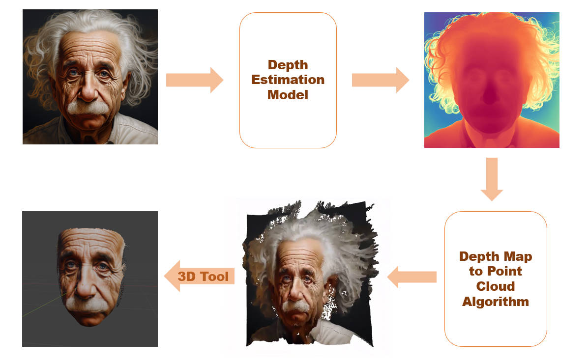

# Synthesis of 2.5D Models Based on Monocular ImagesFace Reconstruction Based on Depth Estimation Map
### Author: Fang Lingxiao

## Usage
1. Place one or more input images in the folder `input`.

2. Set up the environment:

    ```bash
    python -m venv venv/ depth2mesh
    source venv/depth2mesh/bin/activate
    pip install -r requirements.txt
    ```

3. Checkpoint

    The [LCM checkpoint](https://huggingface.co/prs-eth/marigold-lcm-v1-0) is distilled from our original checkpoint towards faster inference speed (by reducing inference steps). The inference steps can be as few as 1 to 4

4. Run FaceReconstruction.ipynb file, you can change the parameters to get better result.


## 1. Introduction
3D face reconstruction from a single image is an important mission of computer vision. It has been broadly exploited in many different applications, from medical surgery to virtual character generation. Over the past decade, the computer graphics and vision community has made rapid progress in algorithms and methods, especially in the era of deep learning, and many of them have yielded excellent results.However, most of those methods use 3D datasets in the training, which consumes a lot of computing power. Moreover, unlike images which can be internet-scale, the the amount of 3D data is limited. 

In this project, monocular depth estimation is used to reconstruct 3D faces. Monocular depth estimation is an essential technology in the fields of face recognition, augmented reality, and 3D reconstruction. It reduces the dimensionality of the three-dimensional world and projects it into a two-dimensional image, which requires a large amount of prior knowledge to understand the scene. Because of the emergence of deep learning, more and more data can be used for training, and solving problems such as geometric ill-posedness (Ke et al. 2023).
 
The idea of this project is the following: First, an affine-invariant monocular depth estimation method based on the diffusion model called Marigold was used to generate depth maps. It is obtained through fine-tuning based on the pre-trained Stable Diffusion. Then, as the estimated depth maps contain depth information, they can be utilized to generate point clouds by obtaining spatial information for each pixel point. 

## 2. 3D Face Reconstruction Based on Depth Estimation
The overview diagram is shown in Figure below.


## 3. Conclusion
This project implemented a diffusion-based solution for depth estimation of 2D images for 3D face reconstruction. This is an ill-posed problem; however, it gives a new perspective to accomplish face 3D reconstruction task. This project not only supports the reconstruction of faces but also any objects. In addition, the system does not require complex hardware devices and can be easily used by general users with 3D software. Future tasks will mainly address the low accuracy of the generated models and noise.


